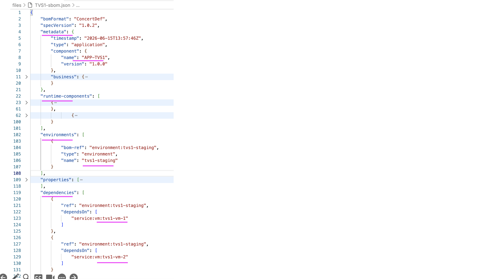
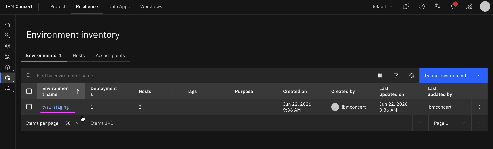
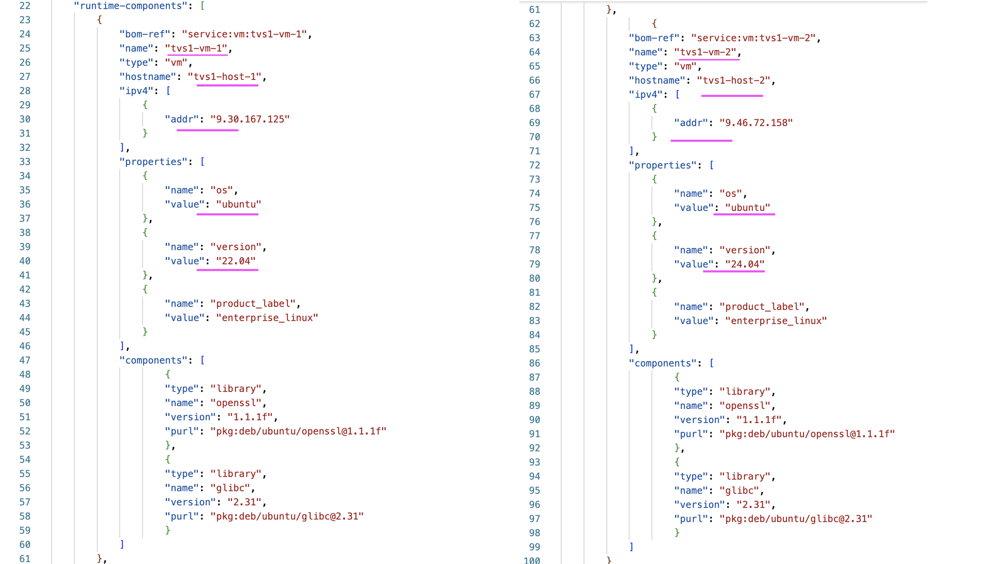
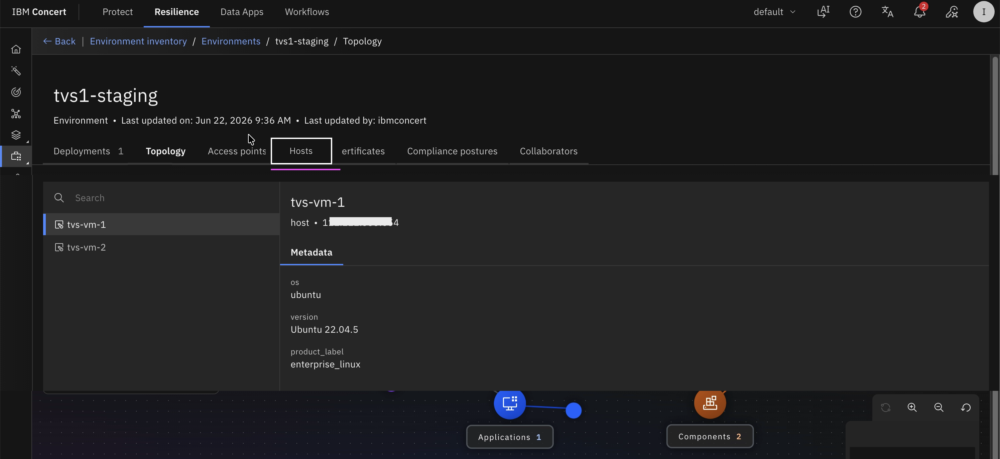
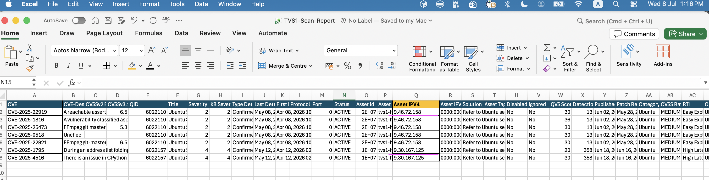
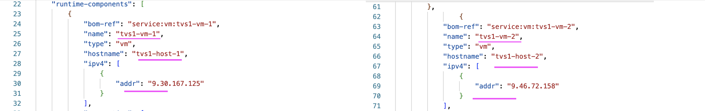

# Creating an Application SBOM File Manually in IBM Concert

This document provides step-by-step instructions for manually creating an Application SBOM file in IBM Concert.

## 1. Application SBOM Structure

A sample SBOM JSON file is available [here](./files//TVS1-sbom.json).

1. The SBOM structure is shown below. It consists of four main sections.

2. The **metadata** section (line 4) contains the **application/component name** (line 8). In this example, the value is **APP-TVS1**. This application name will appear in the **Application Inventory** page, as shown below.

3. The **runtime-components** section (line 22) contains the details of the virtual machines (VMs).

4. The **environments** section (line 102) contains the **stage name** (line 106). In this example, the value is **tvs1-staging**. This stage name will appear in the **Environment Inventory** page, as shown below.

5. The **dependencies** section (line 119) contains the list of associated **VM names** (lines 123 and 129).

## 2. Runtime Components (VMs)

1. The structure of the **Runtime Components** section in the SBOM is shown below. You can define any number of VMs by adding additional VM entries within this section.

2. The **name** field (line 25) represents the VM name or hostname.

3. The **addr** field (line 30) represents the IP address of the VM or host.

4. The **value** field (line 36) specifies the **operating system name**. [Refer](https://www.ibm.com/docs/en/concert/3.0.x?topic=workflows-configuring-auto-remediation#configuring_auto_remediation_workflows_in_concert__table_1) to the supported OS names list for valid values .

5. The **value** field (line 40) specifies the **operating system version**. Refer to the supported OS versions list for valid values. 
The version should be specified in the format xx.xx (major version and minor version).

6. The VMs defined in the Runtime Components section are displayed under the **Hosts** section of the Environment Inventory page.

## 3. Correlation Between the Scan Report and Application SBOM

The correlation between the vulnerability scan report and the Application SBOM is established using the IP address information. Specifically, the **Asset IPv4** column in the scan report is matched with the **addr** field of the corresponding VM in the **Runtime Components** section of the Application SBOM.

This mapping enables IBM Concert to associate identified vulnerabilities with the correct VM, application, and environment, providing application-aware vulnerability analysis and remediation recommendations.

